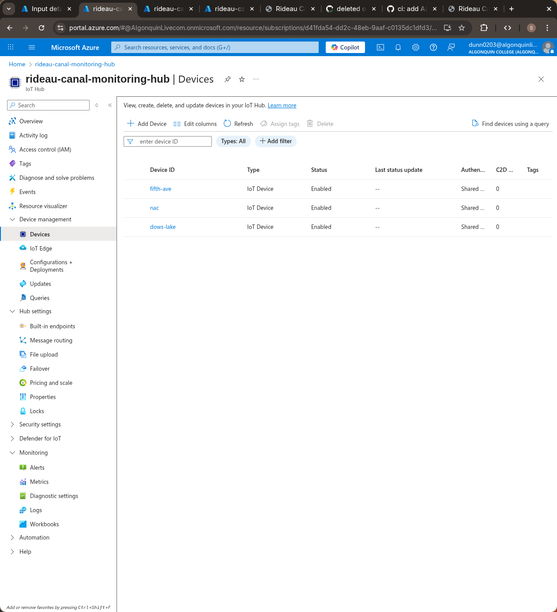
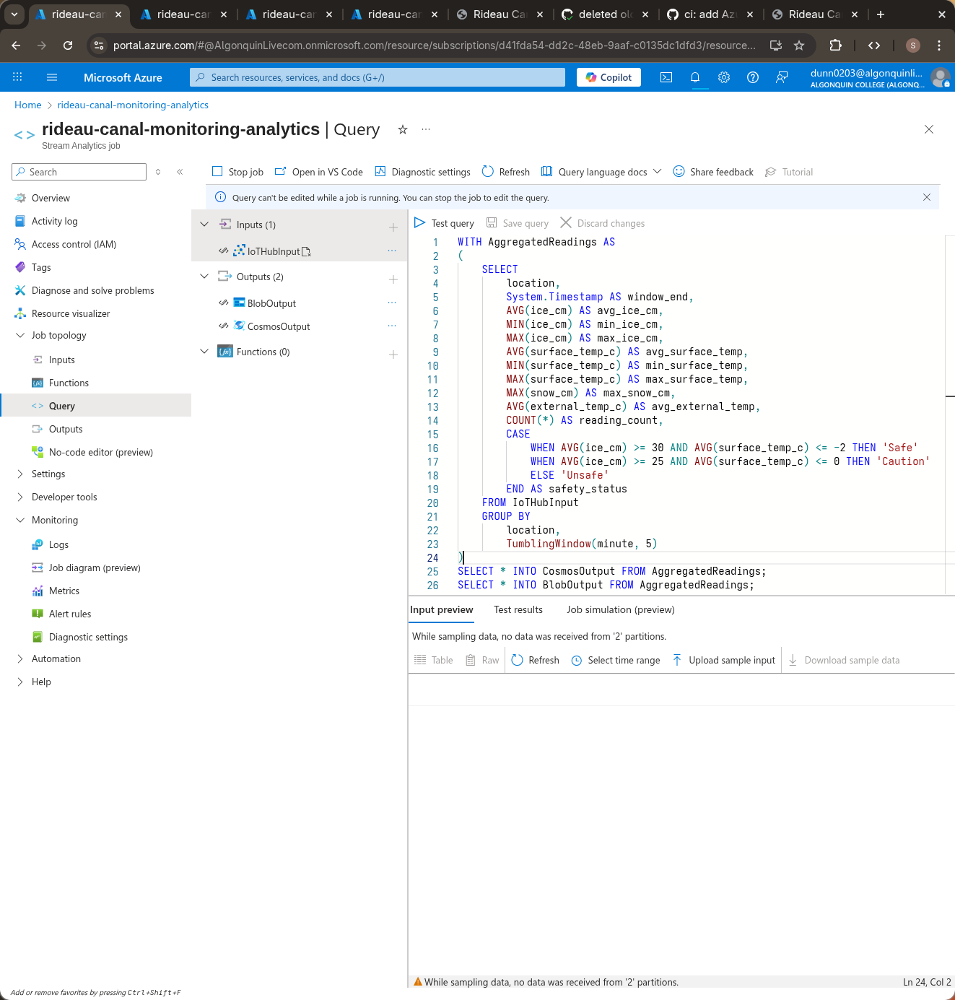
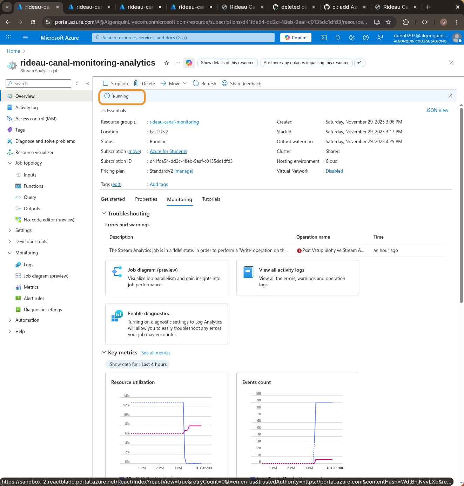
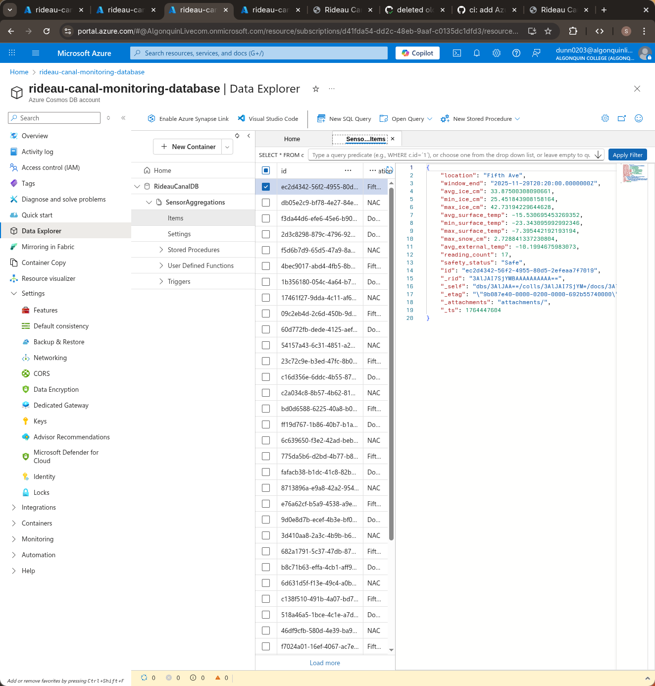
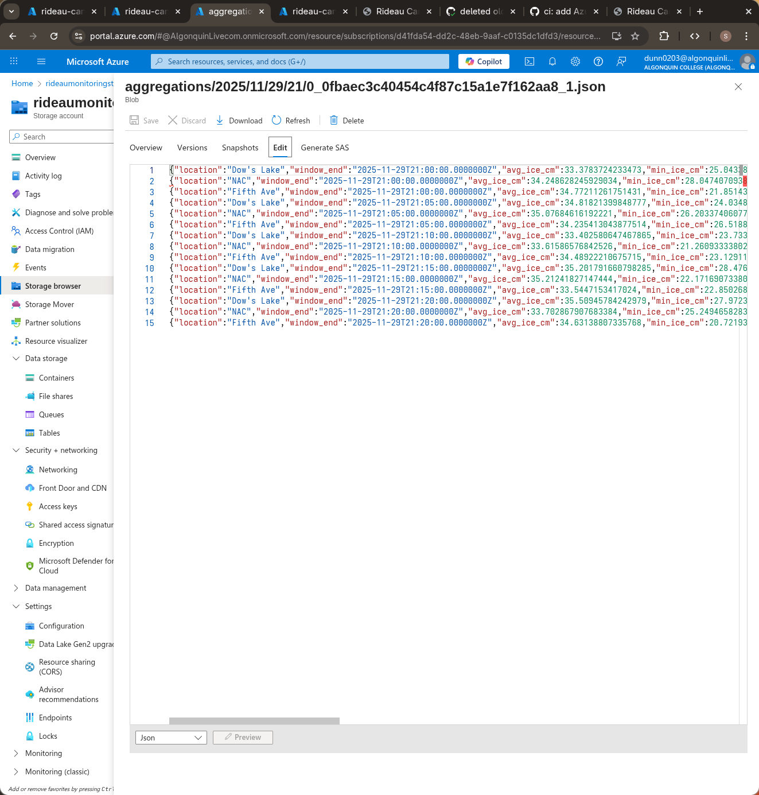
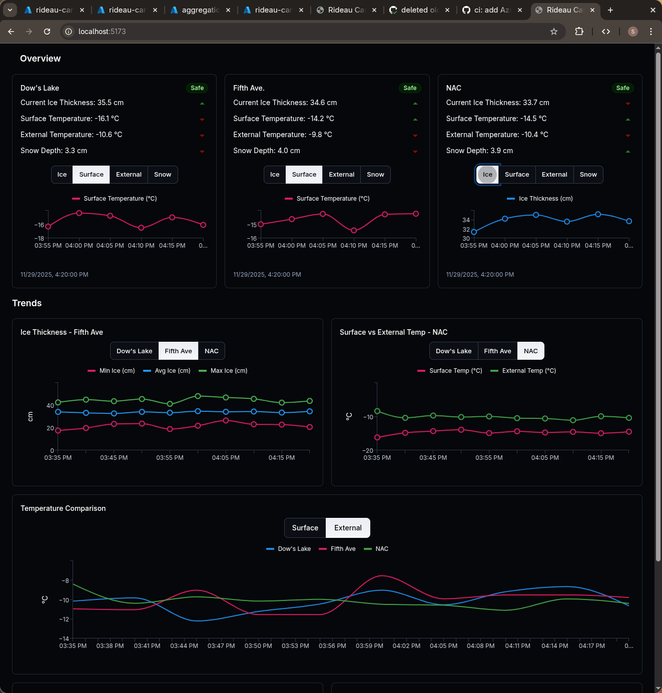
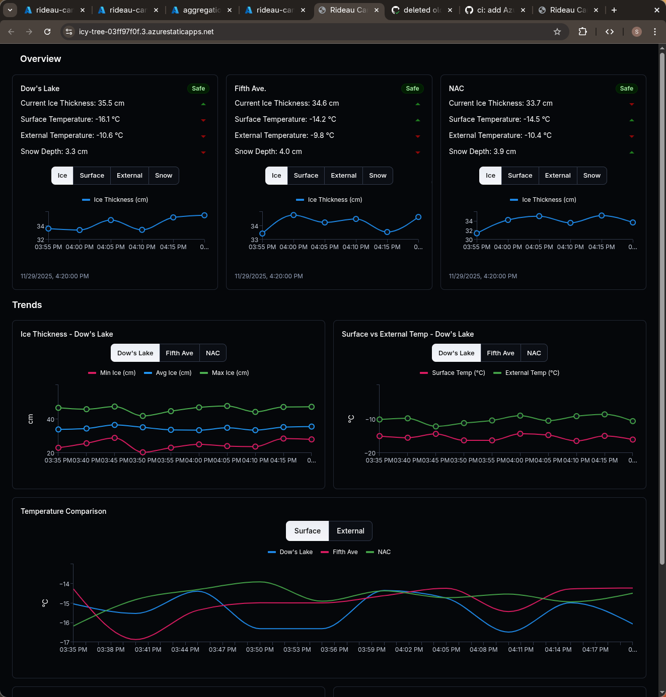

# Rideau Canal Real-time Monitoring System

This project implements a real-time monitoring platform to observe the skating
conditions on the Rideau Canal.

Features include:

- Simulated multi-device telemetry ingestion through Azure IoT Hub
- Live stream processing with Azure Stream Analytics
- Low-latency data access via Cosmos DB
- Archival storage in Blob Storage
- Web-based data visualization dashboard

This project demonstrates key cloud engineering concepts including event-driven
architectures, tumbling window analytics, distributed data storage, and
real-time UI updates. It shows a production-ready implementation of an IoT
analytics stack from device to dashboard.

## Student Information

- **Name:** Sebastien Dunne
- **Student ID:** 040938887

## Project Repositories

- [Main Documentation](https://github.com/DunneDev/rideau_canal_monitoring)
- [Sensor Simulation](https://github.com/DunneDev/rideau_canal_sensor_simulation)
- [Dashboard Backend](https://github.com/DunneDev/rideau_canal_dashboard_backend)
- [Dashboard Frontend](https://github.com/DunneDev/rideau_canal_dashboard_fontend)

## Scenario Overview

The National Capital Commission requires a monitoring system to track:

- Ice Thickness (cm)
- Surface Temperature (°C)
- Snow Accumulation (cm)
- External Temperature (°C)

The goal is to:

- Stream device data to Azure IoT Hub
- Process data in 5-minute tumbling windows
- Store processed aggregates
- Display live status & safety classifications
- Provide real-time insights for canal operation teams

## System Architecture


### Data Flow

#### 1. IoT Sensors

Simulates IoT devices that send telemetry data every 10
seconds from:

- Dow’s Lake
- Fifth Avenue
- NAC

#### 2. Azure IoT Hub

- Central ingestion point for device telemetry.

#### 3. Azure Stream Analytics

- 5-minute tumbling windows
- Aggregation of all measurements
- Safety rule evaluation
- Output to Cosmos DB and Blob Storage

#### 4. Azure Cosmos DB

- Stores aggregated, query-optimized JSON documents
- Partitioned by `/location`

#### 5. Azure Blob Storage

- Long-term archival
- JSON files organized by date/time

#### 6. Web Backend API

- Written in c-sharp using .NET
- Exposes endpoint for accessing aggregated sensor data

#### 7. Web Frontend Dashboard

- Created in React with Material UI
- Auto-refresh + status indicators

### Azure Services used

| Azure Service    | Purpose                                                                                                                       |
| ---------------- | ----------------------------------------------------------------------------------------------------------------------------- |
| IoT Hub          | Enables secure device connectivity and ingestion of telemetry from all IoT endpoints                                          |
| Stream Analytics | Processes real-time telemetry from IoT Hub and generates transformed or filtered outputs for downstream storage and analytics |
| Storage Account  | Provides cost-effective archival storage for raw and historical IoT telemetry data                                            |
| Cosmos DB        | Stores structured, query-optimized IoT data for fast retrieval by the monitoring dashboard                                    |
| App Service      | Hosts the backend API that exposes processed IoT data and operational insights to the dashboard                               |
| Static Web App   | Serves the web-based monitoring dashboard with integrated CI/CD and API routing.                                              |

## Implementation Overview

1. [IoT sensor simulator](https://github.com/DunneDev/rideau_canal_sensor_simulation)

Simulates IoT devices sending sensor readings (ice thickness, temperature, snow
depth) to an Azure IoT Hub instance. It connects to IoT hub using MQTT using a
SAS token.

2. Azure IoT hub

The hub ingests data coming from the devices. There are 3 devices registered, 1 per location.



We can see below some metrics about the messages coming from the devices


3. Stream Analytics

Stream Analytics processes the messages coming from the IoT Hub in real-time.
It uses 5-minute tumbling windows to aggregate telemetry data. It stores the
results blob storage and CosmosDB. Below is the query used:

```sql
WITH AggregatedReadings AS
(
    SELECT
        location,
        System.Timestamp AS window_end,
        AVG(ice_cm) AS avg_ice_cm,
        MIN(ice_cm) AS min_ice_cm,
        MAX(ice_cm) AS max_ice_cm,
        AVG(surface_temp_c) AS avg_surface_temp,
        MIN(surface_temp_c) AS min_surface_temp,
        MAX(surface_temp_c) AS max_surface_temp,
        MAX(snow_cm) AS max_snow_cm,
        AVG(external_temp_c) AS avg_external_temp,
        COUNT(*) AS reading_count,
        CASE
            WHEN AVG(ice_cm) >= 30 AND AVG(surface_temp_c) <= -2 THEN 'Safe'
                WHEN AVG(ice_cm) >= 25 AND AVG(surface_temp_c) <= 0 THEN 'Caution'
                ELSE 'Unsafe'
            END AS safety_status
      FROM IoTHubInput
    GROUP BY
        location,
        TumblingWindow(minute, 5)
)
SELECT * INTO CosmosOutput FROM AggregatedReadings;
SELECT * INTO BlobOutput FROM AggregatedReadings;
```

Shown below are screenshots of the query running in stream analytics




4. CosmosDB

CosmosDB stores the results of the stream analytics. It serves the data that
will be used by the dashboard. Shown below is the CosmosDB instance holding the
processed data:



5. Blob Storage

Blob storage stores the archival data of the stream analytics. It uses cold
access tier which is cheaper when not reading the data often. Shown below is
the blob storage holding the archive data.



6. [Web Dashboard Backend](https://github.com/DunneDev/rideau_canal_dashboard_backend)

The backend exposes a single route which will be used to serve the data to the frontend. The backend queries CosmosDB to get the data. The Backend is hosted on Azure App Service

7. [Web Dashboard Frontend](https://github.com/DunneDev/rideau_canal_dashboard_fontend)

The frontend requests the data from the backend. Once the data is recieved it
creates visualizations using the data. The frontend was created using the
Material UI and React. Shown below are images of the dashboard running locally
and on Azure Static Web Apps.




## Video Demo

<https://youtu.be/n6-EJYl2b84>

## Setup instructions

### Prerequisites

- Rust
- .NET SDK
- Node.js

### High Level Overview

- Create IoT tub
- Create the devices
- Put Device SAS token in .env of simulator
- Create CosmosDB
- Create Blob Storage
- Set up Stream Analytics query
- Run Simulation
- Deploy backend to App Service
- Deploy frontend to Static Web Apps

## AI Disclosure

Copilot was when coding which autocompleted many sections of my code. AI was
also used in the generation of README content in the repos for the backend,
frontend, and sensor simulator.
